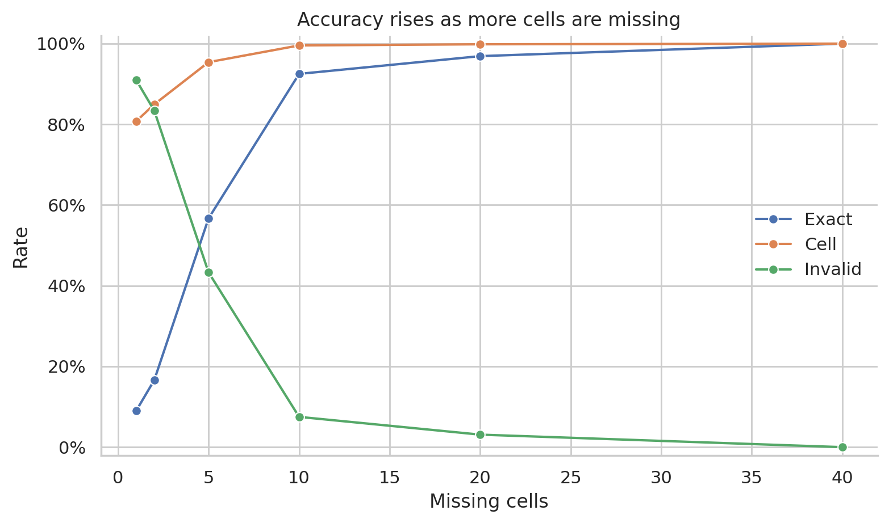
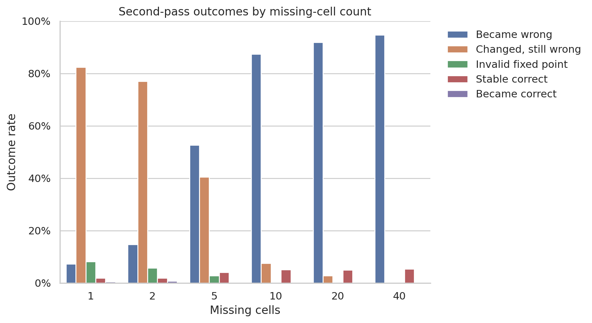
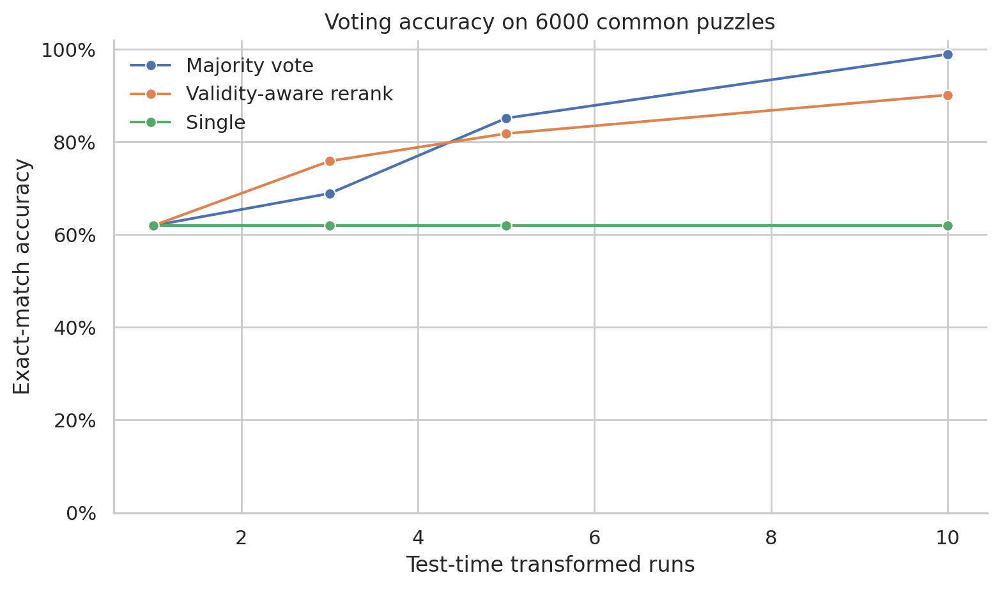
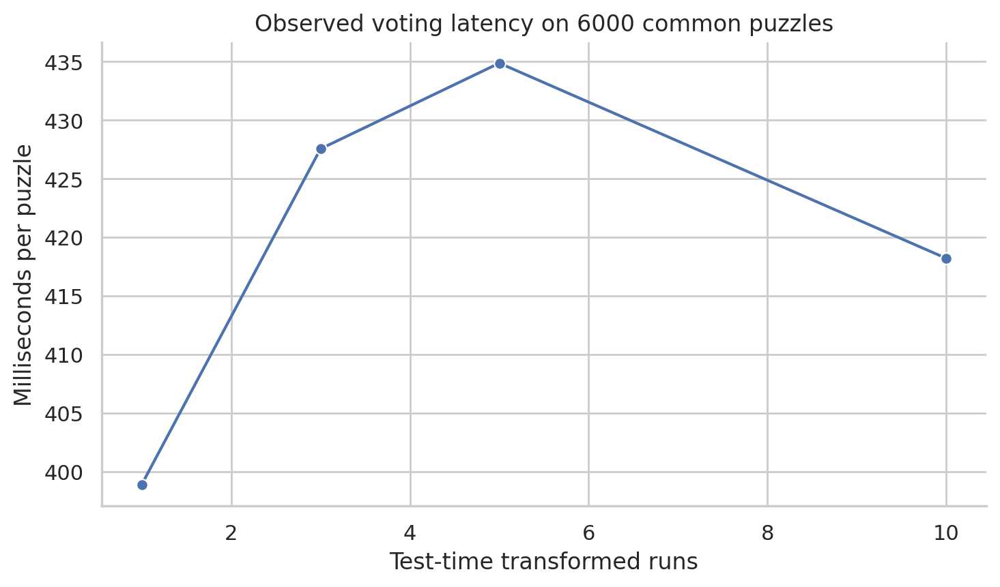

# Fixed-Point Failure Modes and Test-Time Voting in HRM Sudoku

This repository is an **evaluation study** of the released 27M-parameter
[Hierarchical Reasoning Model](https://github.com/sapientinc/HRM) (HRM) on
controlled Sudoku perturbations. The architecture, training pipeline, and
checkpoint are from Sapient Intelligence. This fork adds the diagnostic
experiments, metrics, tests, and writeup.

It asks two questions:

1. Are HRM's Sudoku solutions stable when the prediction is fed back into the model, or can the model leave a correct board for a wrong or invalid one?
2. Can Sudoku-preserving test-time transforms and voting raise exact-match accuracy, and at what runtime cost?

## Headline Results

The evaluation uses the official
[`sapientinc/HRM-checkpoint-sudoku-extreme`](https://huggingface.co/sapientinc/HRM-checkpoint-sudoku-extreme)
checkpoint and **6,000** controlled puzzles: 1,000 uniquely solvable boards at
each of six missing-cell counts (`1, 2, 5, 10, 20, 40`). These are
distribution-shift tests, not conventional human-rated Sudoku difficulty.

Three findings:

- **Near-complete boards fail.** Exact-match accuracy is **9.0%** with 1 missing cell and **100.0%** with 40 missing cells. Pooled one-pass exact match is **62.0%** (cell accuracy **93.4%**, invalid-output rate **38.1%**).
- **Correct solutions are not fixed points.** A second inference pass made **3,486 of 3,717** initially exact boards wrong (**93.8%**) and corrected only **14 of 2,283** initial errors (**0.6%**). After refeed, pooled exact match falls from 62.0% to **4.1%**.
- **Voting recovers accuracy at a measured cost.** On the same 6,000 boards, 10-way Sudoku-preserving majority vote reaches **98.9%** exact match (rerank **90.2%**; single run stays **62.0%**). Mean voting latency is **420 ms/puzzle**, about **22×** the batched one-pass baseline (**18.9 ms**). This is extra test-time compute, not a trained model change.

| Missing cells | 1 | 2 | 5 | 10 | 20 | 40 |
| --- | ---: | ---: | ---: | ---: | ---: | ---: |
| Exact-match accuracy | 9.0% | 16.6% | 56.7% | 92.5% | 96.9% | 100.0% |
| Invalid-output rate | 91.0% | 83.4% | 43.3% | 7.5% | 3.1% | 0.0% |

| Votes | Single | Majority | Rerank |
| --- | ---: | ---: | ---: |
| 1 | 62.0% | 62.0% | 62.0% |
| 3 | 62.0% | 68.9% | 75.9% |
| 5 | 62.0% | 85.1% | 81.8% |
| 10 | 62.0% | 98.9% | 90.2% |

The reversal across missing-cell counts suggests sensitivity to the
checkpoint's training distribution. It is not evidence that Sudoku becomes
intrinsically easier when more clues are removed. See
[report.md](report.md) for methods, definitions, limitations, and the full
tables.









## What's in this fork

| Path | Role |
| --- | --- |
| `experiments/hrm_sudoku/` | Study library: tokens, validity metrics, transforms, refeed classification |
| `experiments/*.py` | Baseline eval, controlled puzzle generation, fixed-point diagnostics, voting, plots |
| `tests/` | Unit tests for Sudoku utils, transforms, generation, and refeed labels |
| `results/` | Per-puzzle evaluation CSVs (no weights or boards) |
| `figures/` | Plots used in this README and the report |
| `report.md` | Methods, results, limitations, reproduce commands |
| `UPSTREAM.md` | Original HRM training and architecture README |

## Reproducing the Study

Run inference on a Linux CUDA machine or CUDA-enabled WSL. CPU-only
environments are enough for `pytest` but not checkpoint inference.

```bash
python -m venv .venv
source .venv/bin/activate
pip install --upgrade pip packaging ninja wheel setuptools setuptools-scm
pip install torch torchvision torchaudio --index-url https://download.pytorch.org/whl/cu126
pip install flash-attn --no-build-isolation
pip install -r requirements.txt
pip install -r requirements-study.txt

huggingface-cli download sapientinc/HRM-checkpoint-sudoku-extreme --local-dir checkpoints/sudoku_extreme_hf
python dataset/build_sudoku_dataset.py --output-dir data/sudoku-extreme-1k-aug-1000 --subsample-size 1000 --num-aug 1000
```

```bash
python -m pytest

python experiments/make_controlled_sudoku.py --limit 1000

python experiments/baseline_eval.py \
  --checkpoint checkpoints/sudoku_extreme_hf/checkpoint \
  --controlled-root data/controlled_sudoku \
  --batch-size 32 \
  --output results/controlled_baseline.csv

python experiments/fixed_point_diagnostics.py \
  --checkpoint checkpoints/sudoku_extreme_hf/checkpoint \
  --controlled-root data/controlled_sudoku \
  --batch-size 32 \
  --output results/fixed_point.csv

python experiments/test_time_voting.py \
  --checkpoint checkpoints/sudoku_extreme_hf/checkpoint \
  --controlled-root data/controlled_sudoku \
  --vote-counts 1,3,5,10 \
  --limit 1000 \
  --output results/voting.csv

python experiments/plot_results.py \
  --baseline results/controlled_baseline.csv \
  --fixed-point results/fixed_point.csv \
  --voting results/voting.csv
```

Set `PYTHONPATH` to `experiments` and `DISABLE_COMPILE=1` when running the
study scripts. The inference scripts are deterministic for a fixed checkpoint,
dataset, and seed.

Token convention used throughout the study: `PAD=0`, blank Sudoku cell
`0 -> token 1`, and digit `d -> token d+1`.

## Scope and Attribution

The HRM architecture, training pipeline, original datasets, and released
checkpoint come from [Sapient Intelligence's upstream HRM
repository](https://github.com/sapientinc/HRM). Training and architecture
documentation is in [UPSTREAM.md](UPSTREAM.md). This fork adds the controlled
Sudoku generators, evaluation and transformation-voting experiments, metrics,
tests, result tables, plots, and study report. The upstream Apache 2.0 license
is retained.

```bibtex
@misc{wang2025hierarchicalreasoningmodel,
      title={Hierarchical Reasoning Model},
      author={Guan Wang and Jin Li and Yuhao Sun and Xing Chen and Changling Liu and Yue Wu and Meng Lu and Sen Song and Yasin Abbasi Yadkori},
      year={2025},
      eprint={2506.21734},
      archivePrefix={arXiv},
      primaryClass={cs.AI},
      url={https://arxiv.org/abs/2506.21734},
}
```
